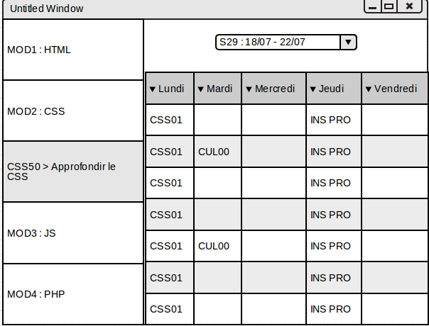
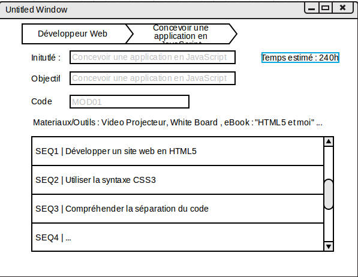

# Specification Dossier : TrainingORM v0.1

##Description du projet
Dans le cadre de la formation SIMPLON, un programme pédagogique ainsi que son planning associé est à définir. 
FACE Rennes, n'a à l'heure actuelle, aucune application afin de faciliter ce travail. 
L'objectif est donc de réaliser une application permettant la conception de la formation ainsi que son suivi. 

Dans un second temps, cette application permettra de réaliser un suivi en temps réel ainsi que la gestion de KPI et de reporting. 

Cette application est destinée à être implémentée en méthodologie SCRUM. Plusieurs échanges auront lieu entre le commanditaire appelé 'Lead Formateur' et le développeur appelé 'Assistant Formateur'.

Cette application n'a pas pour but de gérer la promotion des apprenants. Mais est vouée à gérer uniquement la formation dispensée. 

## La structure du site 
Le site web, doit être scindée en deux sections : Back-End et Front-End. Cette application ne nécessitera pas pour autant, dans un premier temps, une gestion de compte utilisateur poussée. 

* Tout utilisateur aura le droit d'accès à la partie front.
* Uniquement l'utilisateur admin / mdp aura accès à la partie back end.

Le Front-End contiendra les parties suivantes :

* Planning
* Programmes de formation
* Reporting

Le Back-End contiendra les parties suivantes : 

* Gestion du planning
* Gestion des programmes de formation

Ces parties seront détaillées dans les chapitres suivants. 

## Le design du site
A l'heure actuelle, Face n'a pas véritablement de charte graphique proprement définie. Il serait nécessaire néanmoins d'utiliser leurs couleurs ainsi que de faire apparaître le logo de face. 

## Le Front-End
### Planning
Le planning doit être accessible par deux manières:

* Export XML
* Visualisateur au sein de la page

Un planning est spécifique à une promo. 
Un planning doit affiche une ligne par semaine.

#### Export XML
L'export XML devra respecter le DTD suivant : 
```xml
<!ELEMENT Planning (Semaine*) >
<!ELEMENT Semaine (Jour*)>
<!ELEMENT Jour (Task*)>
<!ELEMENT Task (#PCDATA)>
<!ATTLIST Semaine number CDATA "0">
<!ATTLIST Jour ferie (true|false) "false">
<!ATTLIST Jour number CDATA "0">
<!ATTLIST Task time CDATA "7">
```

#### Visualisateur
Une visualisation simple du planning est souhaitée. L'assistant formateur peut fortement s'inspirer d'Erwannface.github.io afin de voir un aperçu souhaité. 
Hormis le fait qu'il est nécessaire de sélection dans un premier temps le programme pédagogique souhaité

### Programmes de formation
Un programme de formation est spécifique à un type de formation donné. Pour exemple, dans le cadre de la formation de la Grande Ecole du numérique dispensée au sein de FACE Rennes, nous avons plusieurs programmes de formation pour la Promo 01 (Tronc Commun, Développeur Web PHP, Chargé de projet numérique).

Un programme de formation est structuré en modules.
Chaque module est décomposé en séquences.
Chaque séquence est décomposée en activité. 

Les programmes de formations doivent être disponibles sous deux formats : 

* Export XML
* Visualisateur au sein de la page

#### Export XML
L'export XML devra respecter le DTD suivant : 
```xml
<!ELEMENT root (Programme*) >
<!ELEMENT Programme (Intitule, Module*) >
<!ATTLIST Programme formation CDATA #IMPLIED>
<!ELEMENT Module (Intitule, Objectif, PreRequis, Materiel, Code, Sequence*)>
<!ATTLIST Module language CDATA "">
<!ATTLIST Module group CDATA "">
<!ELEMENT Sequence (Intitule, Objectif, Code, Evaluation, Activite*)>
<!ELEMENT Activite (Objectif, Code, Materiel?, Temps, SousObjectif?, Description?)>
<!ATTLIST Activite done (true|false) "false">
<!ELEMENT Intitule (#PCDATA) >
<!ELEMENT Objectif (#PCDATA)>
<!ELEMENT Description (#PCDATA)>
<!ELEMENT PreRequis (#PCDATA) >
<!ELEMENT Materiel (#PCDATA) >
<!ELEMENT SousObjectif (#PCDATA) >
<!ELEMENT Temps (#PCDATA) >
<!ELEMENT Code (#PCDATA) >
<!ELEMENT Evaluation (#PCDATA) >
```

#### Visualisateur

Une visualisation simple du programme est souhaitée. L'assistant formateur peut fortement s'inspirer d'Erwannface.github.io afin de voir un aperçu souhaité. 
Hormis le fait qu'il est nécessaire de sélection dans un premier temps le programme pédagogique désiré

### Le Reporting

Un utilisateur , doit à tout moment pouvoir réaliser un reporting sur un programme de formation. 

Une liste de choix affichera le niveau de détail souhaité par l'utilisateur. 

Ce reporting affichera au sein d'un tableau, Les intitulés des Modules, Séquences et Activités accompagnés, au sein d'une seconde colonne du temps planifié.

##  Le Back-End
Une interface d'administration de l'application sera accessible via l'url <site-web/admin. 
Cette partie de l'application ne sera accessible qu'à l'utilisateur admin / mdp. Si un utilisateur essaye d'y accéder une fenêtre popup apparaître pour contraindre l'utilisateur à saisir ses identifiants. 
Si ces derniers ne sont pas corrects, l'utilisateur sera redirigé vers le Front-End. 

### Gestion du planning

Un planning est spécifique à un programme de formation. 
Une fois que l'administrateur a sélectionne le programme de formation sur lequel il souhaite travailler, une page d'administration sera affichée. 



#### Menu de gauche

Au sein du menu de gauche, l'ensemble des modules, des séquences et des activités définies au sein du programme seront affichés en accordéon.

Toute activité ayant déjà été planifiée entièrement (durée planifiée > temps défini) doit être affichée en grisée.

Aucune Séquence ou Activité fermée ne sera affichée au sein de ce menu.

#### Fenêtre principale

Au sein de la fenêtre principale il doit être possible de choisir la semaine concernée. 
Ce qui affiche automatiquement le planning déjà défini en dessous. 
Par le biais de drag and drop, l'administrateur doit avoir la possible de glisser une activité (Aucun module ou séquence, uniquement activité) au sein du planning.

Une fois qu'un utilisateur réalisé celà, une fenêtre modale apparaît afin qu'il spécifie la durée de l'activité. 
Le champ durée doit être prérempli par la valeur pré-définie.

### Gestion des programmes de formation
Lorsque l'utilisateur arrive au sein de cette page. La liste des programmes existants doit être affichée. Il doit être possible d'une manière intuitive de créer un nouveau programme. 
Si l'utilisateur clique sur le nom d'un programme, il est automatique redirigé vers le Programme. 

Un Breadcrumb affiche en haut de page le programme sélectionné. Ainsi que la description du Programme. 
Il doit être facile de pouvoir modifier le programme. 

Et ceci ainsi de suite. 

#### Un Programme de formation

Un programme de formation contient l'ensemble des modules, des séquence et des activités d'une formation. 

Un Programme de Formation est composé de Modules.

```php
class ProgrammeDeFormation {
    private $id; //int
    public $intitule; //string
}
```

#### Un Module de formation



Un Module est composé de Séquences.
Un Module peut appartenir à plusieurs Programmes.

```php
class ModuleDeFormation {
    private $id; //int
    public $intitule; //string
    public $objectif; //string
    public $code; //string
}
```

#### Une Séquence de formation
Une Séquence est composée d'Activités.
Une Séquence peut être fermée au sein d'un Programme donné.
```php
class SequenceDeFormation {
    private $id; //int
    public $intitule; //string
    public $objectif; //string
    public $code; //string
    public $evaluation; //string
}
```

#### Une Activité de formation
Une Activité peut être fermée au sein d'un Programme donné.

```php
class ActiviteDeFormation {
    private $id; //int
    public $intitule; //string
    public $objectif; //string
    public $objectifFormateur; //string
    public $objectifApprenant;
    public $code; //string
    public $evaluation; //int (basé sur un ENUM : ponctuelle/sommative/... (il y en 6))
    public $evaluationDesc; //string
    public $temps; //int (nbHeures)
    public $demarche; //int (basé sur un ENUM : deductive/inductive)
}
```

### Materiel/Outils

Une activité peut nécessiter des outils spécifique. Que ce soit un lieu (exemple: sortie à un forum), ou un outil (exemple : video projecteur / paperboard) voire encore un support de cours.

L'ensemble des materiaux requis doit être visible d'une manière concatenée au niveau du Module et de la Séquence.

```php
class OutilsDeFormation {
    private $id; //int
    public $nom; //string
}
```
